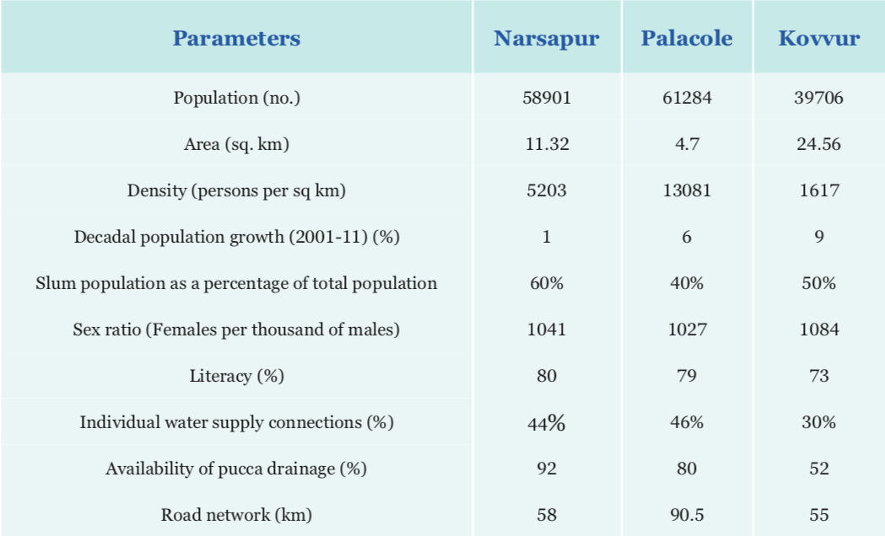

# Study Area

Godavari originates in Maharashtra and empties into Bay of Bengal via Andhra Pradesh after covering a length of 1465 km. It is India’s second longest river after Ganga. Water-to-Cloud began its study in the Kovvur-Rajahmundry stretch and later scaled it to Narsapur stretch. The sites were selected in consultation with ASCI and local administration to monitor the impact of domestic, industrial or agricultural waste water entering from the riverfront towns into the river.

Rajahmundry and Kovvur are located on opposite banks of Godavari. Rajahmundry is hailed as the cultural capital of Andhra Pradesh and is revered as a religious place. Hundreds of pilgrims bathe at the ghats in Rajahmundry each year. It has a population of 341,831 as per 2011 census. Rajahmundry has a sewerage treatment plant with 30MLD capacity. However, certain reports estimate that the city produces 60 MLD of waste and only 10MLD gets treated at this plant. Ava drain carries waste water from the outlet of this treatment facility. In fact, most of the city’s waste is carried by Ava drain and Nala channel $$^{14}$$ .

Narsapur is a relatively small town about 20 km before Godavari meets the Bay of Bengal. Thewaters here are highly affected by sea waters flowing back into the river. Since Narsapurdoes not have any major industries, most of the waste water is characterized by domestic waste. A solid waste dumping site is situated at the bank of Narsapur. A fecal sludge treatment plant \(FSTP\) has been set up by the town with support from ASCI in 2017. A slaughterhouse is found to discharge its waste water into a nearby drain directly. Water from a canal in the town, Pilla Kaluva is used for drinking by some of the village dwellers downstream. Unfortunately, some drains are connected directly to this canal in Narsapur rendering this water unsafe for consumption.

A need was felt to go beyond monitoring river water quality to assess the waste water quality in different drains in Narsapur, Palacole and Kovvur. The general profile of the three towns is explained on the table below and the details of the drainage system in each town are described thereafter.

