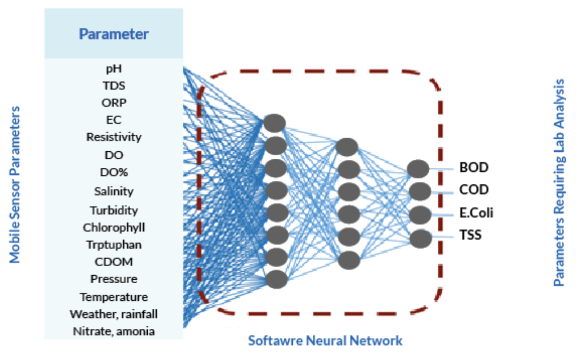

# Machine Learning

Parameters such as BOD and COD are critical to understand organic pollution in water. However, it is challenging to monitor these parameters reliably through real-time, in-situ sensors. Currently, we rely on laboratory measurements which are both time and cost intensive. BOD test takes upto five days in laboratory. As a result, the number of data points available on these parameters are limited. With a lot more data available from in-situ \(measurable on-site using sensor\) parameters such as temperature, EC, pH, DO\), etc., Water-to-Cloud team explored the possibility of predicting ex-situ \(measurable in labs\) parameters such as BOD and COD by drawing correlations with in-situ parameters. The idea was to use sensor fusion for measuring multiple parameters in real time and neural network models to estimate lab- based parameters from sensor-based parameters. This would reduce the reliance on costly, time consuming lab measurements. Various machine learning \(ML\) models were applied and the results are explained in a later section. Such models, if successful, would allow for a quick and efficient estimation of such crucial parameters to develop a deeper understanding of the pathogen levels in rivers.

