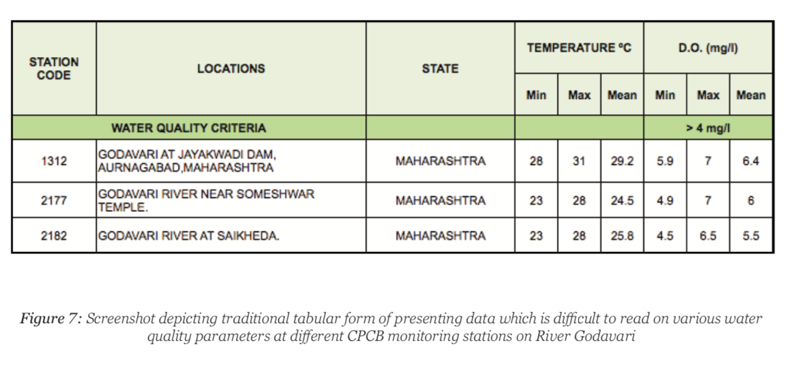
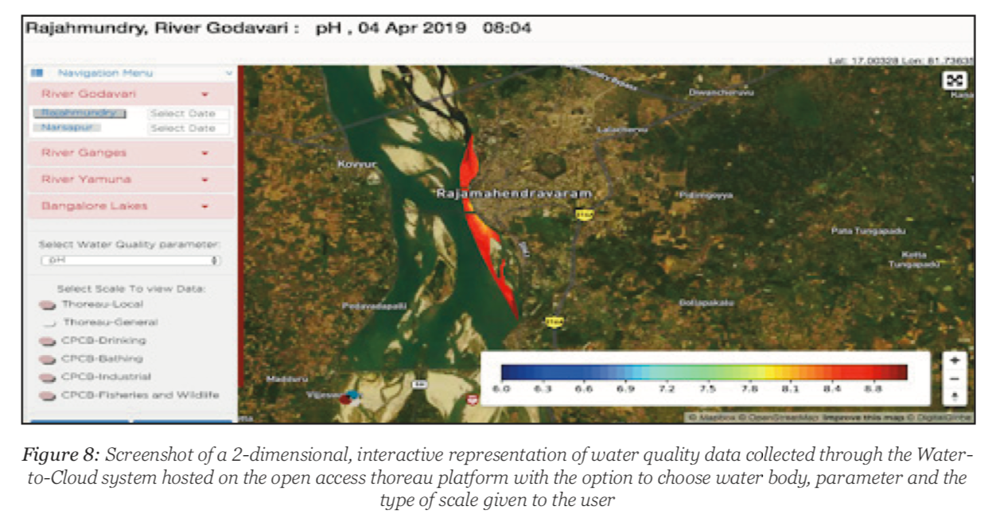
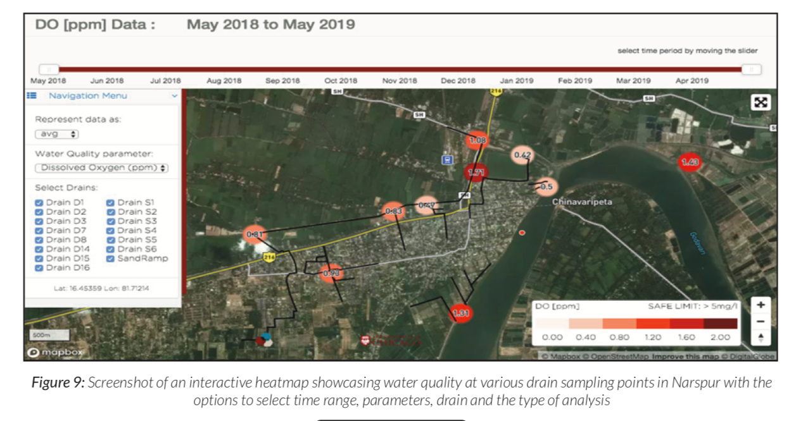

# Visualization

Conventionally, water quality data is presented in tables or charts that are difficult to interpret or analyze. A snapshot from CPCB website shows the data from 2013 for Godavari. It was last updated in November 2018$$^{12}$$ .

Color-coded visualisations, on the other hand, areeasy to understand for laypersons, sanitation staffworking on ground and decision makers. Data is visualized as 1D heatmap which represents the variation of water quality along the boat route and as 2D heatmap which interpolates the data from the 1D maps to be spread over a larger surface area. Interpolating line maps allows us to create area maps for better visualizations. These provide a user-friendly way to carry out analysis without getting entangled with huge amounts of data or too many technicalities.

These interactive maps allow the user to choose locations, dates, water quality parameters and the scale. They are also used to visualize lab- based point data across a map. Drains heatmap allows one to see lab and sensor data collectedfrom different drains in a town, select/deselectthe drains and select the timespan for the data. A similar heatmap approach is also used for drain monitoring as shown below. The average values of parameters are highlighted at the sampling points of each drain. A time slider can be used to select the time period between which values need to be averaged. This drains heatmap can be effectivein monitoring the overall status of pollution in a town.

