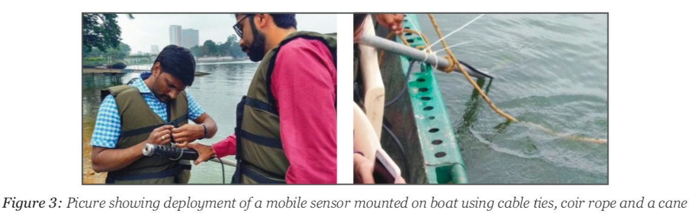
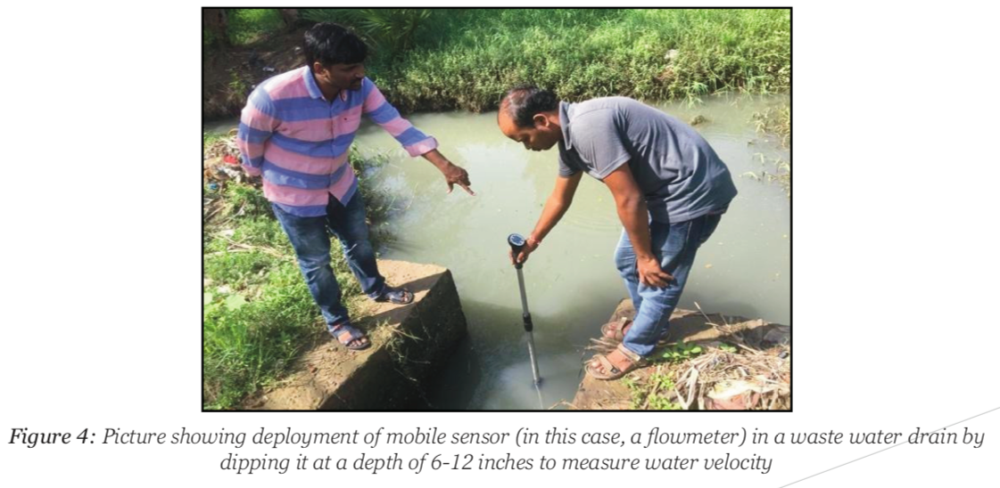
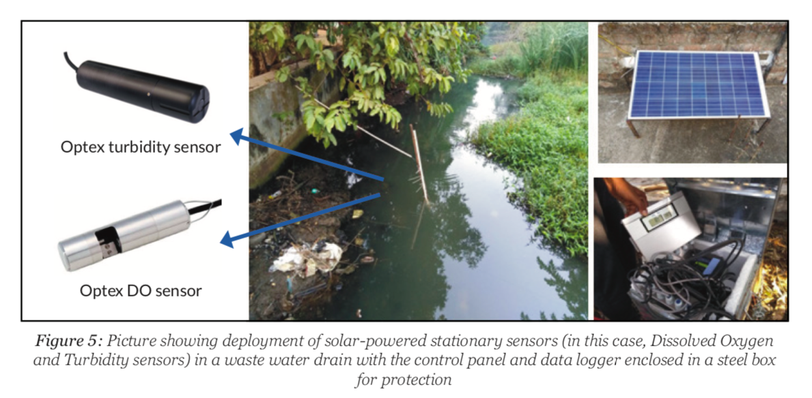

# Operationalization

There are multiple options to carry sensors around a water body such as remote-controlled \(RC\) float boats, manual or motor boats, unmanned automated drones, etc. While commercially-available drones or float boats provide asophisticated means to carry sensors and ensure navigability in smaller streams, drains or channels with shallow waters, they are expensive, require trained staff for operation and would present limitations in carrying lithium-ion batteries and laptop on board along with the multiple sensors. Manual boats or large vessels would be slow and cumbersome in surveying large water bodies. A motor boat driven by a boat person was found to be the most viable and accessible means to carry sensors in rivers due to their easy availability at most sites at affordable rates. Boats are also able to accommodate a technical professional on board to ensure continuous, obstruction- free working of the sensors. In the future, the dependence on boatmen and availability of boats can be minimized by designing water float boats.

Sensors are tied to a rod and immersed continuously at a depth of 1-3 feet under the surface of water. The rod is attached firmly to the side of a boat and the sensors record readings as the boat moves around. We found that a boat speed of 5-6 km/hr is suitable such that the turbidity sensor is not affected by the motion of the boat as it records a value every 15-20 m. Hanna HI 9829 and C3 Submersible Fluorometer are deployed in this manner. UV254 Go! is also attached with these sensors. HI 9829 does not require an additional power source. C3 sensor can be powered by a Lithium-ion battery. FP211 flow probe is used on the boat to note downstream velocity from time to time. Optex Turbidity and Dissolved Oxygen Sensors are fixed at critical locations in a drain and are powered using solar energy.

