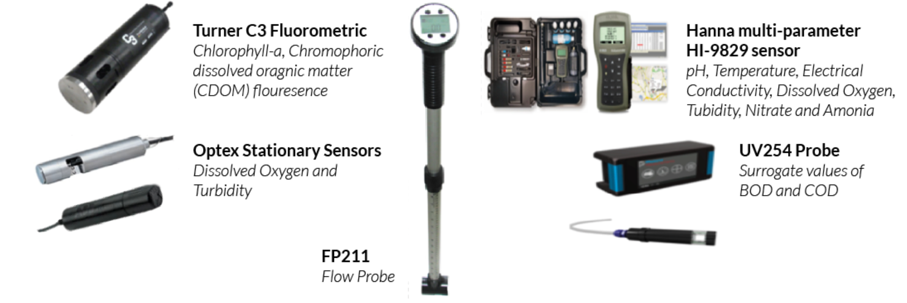

# Sensor Identification and Calibration

Based on the parameters of interest, real-time stamped data are chosen. Currently, the system sensors which collect GPS-tagged and time/date utilizes various kinds of sensors as detailed below.

**Hanna HI9829**

The HI9829 is a waterproof portable logging multi-parameter meter that monitors up to 14 different water quality parameters \(7 measured, 7 calculated\). Some of the parameters that the sensor measures include pH, oxygen reduction potential \(ORP\), conductivity, dissolved oxygen, turbidity, ammonium ions, chloride ions, nitrate ions, and temperature. It has a time stamp capability and consists of a GPS for location tracking of measurements. The system is built to withstand harsh environments and is ideal forfield measurements of lakes, rivers and sea $$^7$$ .

| Parameters | Range | Revolution | Accuracy | Calibration |
| :---: | :---: | :---: | :---: | :---: |
| Temperature | -5.00 to 55.00 °C | 0.01 °C | ± 0.15 °C | Automatic at 1 custom point |
| pH | 0.00 to 14.00 pH | 0.01 pH | ± 0.02 pH | Automatic 1, 2 or 3 points with automatic recognition of 5 standard buffers \(pH 4.01, 6.86, 7.01, 9.18, 10.01\) and 1 custom buffer. |
| Dissolved Oxygen | 0.0 to 500.0% \(0.00 to 50.00 ppm \(mg/L\) | 0.1% 0.01 ppm \(mg/L\) | 0.0 to 300.0 %: ± 1.5 % of reading or ± 1.0 % whichever is greater;300.0 to 500.0 %: ± 3 % of reading 0.00 to 30.00 ppm \(mg/L\): ± 1.5 % of reading or ±0.10 ppm \(mg/L\) whichever is greater;30.00 ppm \(mg/L\) to 50.00 ppm \(mg/L\): ± 3 % of reading | Automatic 1 or 2 points at 0, 100 % or 1 custom point |
| Conductivity | 0 to 200 mS/ cm | 1 μS/cm | ±1 % of reading | Automatic single point, with 6 standard solutions \(84 μS/cm, 1413 μS/cm, 5.00 mS/cm, 12.88 mS/cm,80.0 mS/cm, 111.8 mS/cm\) or custom point |
| Turbidity | 0.0 to 99.9 FNU; 100 to 1000 FNU | 0.1 FNU from 0.0 to 99.9 FNU, 1 FNU from 100 to 1000 FNU | ±0.3 FNU or ±2 % of reading | Automatic 1, 2 or 3 points at 0, 20 and 200 FNU, or custom |

**Turner C3 Submersible Fluorometer**

The C3 Submersible Fluorometer is used to measure tryptophan, chlorophyll, colored Dissolved Organic Matter \(CDOM\). It is based on optical sensing ranging from deep ultraviolet to the infrared spectrum. The sensor requires an external lithium ion battery for extended deployment. The sensor comes with a factory-installed temperature sensor as well. The sensor is cased robustly and is highly resistant to harsh environments. A C-Soft Windows based software can be downloaded into a computer which allows for intuitive calibration, datalogging set-up andfile management capabilities as well as digital oranalog data integration $$^8$$ .

<table>
  <thead>
    <tr>
      <th style="text-align:center">Parameters and specification</th>
      <th style="text-align:center">Minimum Detection Limit</th>
      <th style="text-align:center">Linear Range</th>
    </tr>
  </thead>
  <tbody>
    <tr>
      <td style="text-align:center">Chlorophyll-a (in vivo) Blue excitation</td>
      <td style="text-align:center">0.03 &#x3BC;g/L</td>
      <td style="text-align:center">0-500 &#x3BC;g/L</td>
    </tr>
    <tr>
      <td style="text-align:center">Colored dissolved organic matter</td>
      <td style="text-align:center">1.15 ppb 0.5 ppb</td>
      <td style="text-align:center">
        
0-1500 ppb

        
0-3000 ppb

      </td>
    </tr>
    <tr>
      <td style="text-align:center">Tryptophan</td>
      <td style="text-align:center">3 ppb</td>
      <td style="text-align:center">0-5000 ppb</td>
    </tr>
    <tr>
      <td style="text-align:center">Temperature</td>
      <td style="text-align:center">0.1 &#xB0;C</td>
      <td style="text-align:center">-2 to 50 &#xB0;C</td>
    </tr>
  </tbody>
</table>**FP211 Flow Probe**

Flow Probe is a highly accurate water velocity instrument for measuring flows in open channels and partially filled pipes. The water velocity probe consists of a protected water turbo prop positive displacement sensor coupled with an expandable probe handle ending in a digital readout display. The water flow meter incorporates true velocity averaging for the most accurate flow measurements. It has range of 0.3 -19.9 Feet Per Second \(FPS\) and an accuracy of 0.1 FPS. The Flow Probe is ideal for storm water runoff studies, sewer flow measurements, measuring flows in rivers and streams, and monitoring water velocity in ditches and canals. The flow velocity values obtained from this instrument are used to calculate the waste water load in drains by multiplying them with drain dimensions $$^9$$ .

**Optex Turbidty and Dissolved Oxygen Sensor**

The Optex Turbidty and DO sensors are stationary sensors that are used to measure water quality in drains. They measure turbidity, DO and temperature values every 5 minutes 24X7 and are powered by solar panels. The data from these sensors is wirelessly transmitted on to the cloud and can be accessed through a dashboard. The Optex Turbidity Checker TSC- 10\(E\) uses a method of 90-degree scattered light as the measuring principle of the world common standard. It has a built-in wiper cleaning system and the optical windows are made of hard-to- scratch sapphire glass and therefore can be manually cleaned. The compact design makes it possible to install the sensor easily. The Optex DOS-20 DO sensor can measure both DO levels and the temperature. It is not influenced by the water flow rate $$^{10}$$ .

| Parameters | Range | Accuracy |
| :---: | :---: | :---: |
| DO \(mg/l\) | 0-20 mg/l | ±0.1mg/L \(0~8mg/L\),  ±0.2mg/L \(8~20mg/L |
| Turbidity \(FNU\) | 0-50 FNU | 0.01\(0.00-19.99\),  0.1\(20.0-500.0\) FNU |
| Temperature \(degree C\) | 0-50 degree C | 0.1 degree C |

**UV254 Go!**

Photonic Measurement’s UV254 Dip Go! is a light-weight, portable device, which allows easy measurement of open channel water for parameters such as total organic carbon \(TOC\), dissolved organic carbon \(DOC\), COD and BOD. It has a simple icon-based user interface that makes it easy to navigate between measuring, ****calibration and data collection. It also has extensive storage capacity to preserve numerous measurements. A user can connect and transfer data to a computer system through a USB port. The system has the ability to generate graphical charts of data patterns $$^{11}$$ .

All sensors are calibrated before taking measurements. Before any instrument is calibrated or used to perform environmental measurements, the instrument is stabilized according to the manufacturer’s instructions and it is ensured that there are no air bubbles lodged between the probe and probe guard. As a quick calibration measure, the sensor can be calibrated prior to use on the day the measurements are to be performed. A post calibration check at the end of the day is performed to determine if the instrument drifted out of calibration. A detailed calibration procedure for each instrument and its parameter is attached in appendix VI.

| Parameters | Range | Accuracy |
| :---: | :---: | :---: |
| UVT and SUVA | 0-100% UVT 0-2.5 ABS,  is extendable with shorter path length cuvettes | ±0.5% UVT |
| Total Organic Carbon | 0-120 ppm | 0.1 ppm |
| BOD | 0-140 mg/l | 0.1 mg/l |
| COD | 0-280 mg/l | 0.2 mg/l |
| Dissolved Organic Carbon | 0-100 mg/l | 0.1 mg/l |

