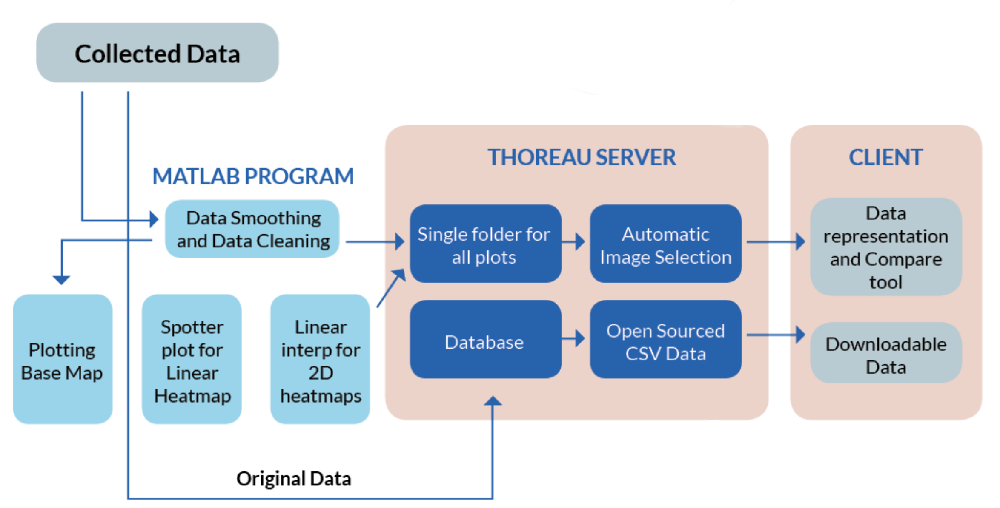

# Data Retrieval

Laboratories may take up to two weeks to analyze water quality samples and deliver results. This time period may be further increased depending on availability of equipment and staff capacity.This slows the access to data. A quick data retrieval and curation system is critical for the Water-to-Cloud approach. Data is retrieved from the sensors in the form of excel files after each boat ride by connecting the logging meter to a computer with a pre-installed setup. The excel files contain geospatial data for different water quality parameters tagged with date and time. These files are processed and converted to CSV formats for further processing. In case of stationary sensors, data is wirelessly transmitted onto the cloud through Global System for Mobile Communications \(GSM\)-based sim cards which are connected to the data logger.

